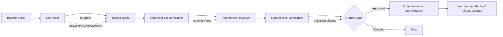

# Bounded Agent Runtime

**Run AI coding agents. Keep authority outside the model.**

Bounded Agent Runtime is an open-source reference runtime for teams that want autonomous coding agents without giving model output direct authority over Git, filesystem scope, approvals, or protected actions.

> **Agents think. The controller authorizes. Evidence proves. Humans approve protected decisions.**

[](LICENSE)
[](docs/00-PREREQUISITES.md)
[](SECURITY.md)

## The 30-second version

AI agents are good at producing code. The hard part is deciding what they are **allowed** to do after that.

Bounded Agent Runtime puts a deterministic controller between the agent and authority:

| Without a bounded runtime | With Bounded Agent Runtime |
| --- | --- |
| Model output can become an action | Model output stays untrusted input |
| A reviewer can accidentally trust stale code | Review evidence is bound to an exact Git commit and tree |
| A retry loop can run indefinitely | Model calls, retries and wall-clock time are budgeted |
| A forged state can claim approval | Human approval is signed, identity-bound and replay-protected |
| Builder and reviewer can blur together | Roles and Windows access boundaries can be separated |
| Merge/deploy logic can drift away from review | Protected authorization re-verifies the candidate before action |

## How it works



The reference runtime intentionally ships **without a real remote-mutation adapter**. The final authorization step proves that policy, evidence, candidate identity and Human Gate checks passed. You decide which external side effect to connect after that boundary.

## What you get

- deterministic controller state transitions
- task-declared `allowed_actions`, `protected_actions` and `allowed_paths`
- lease and fencing checks for stale-controller protection
- model-call, retry and wall-clock budgets
- controller-derived Git commit and tree identity
- exact candidate re-verification after review and before protected authorization
- HMAC-authenticated evidence bound to task, commit and tree
- HMAC-chained journal integrity with truncation detection while its integrity key remains controller-only
- Ed25519 Human Gate approvals with approver identity and public-key fingerprint pinning
- persistent one-time approval nonce consumption for replay protection
- hostile Git environment and hook hardening
- Windows role-account, protected-directory and worker-access verification scripts
- adversarial regression tests for the main authority-bypass classes

## Works with your agent stack

The runtime is **model-agnostic**. It does not require a specific LLM provider.

| Agent/tool | How it fits |
| --- | --- |
| Claude / Claude Code | Wrap as a bounded Builder or Reviewer adapter |
| OpenAI Codex | Wrap as a bounded Builder or Reviewer adapter |
| OpenCode | Replace the demo child-process adapter with your OpenCode launcher |
| Ollama / local models | Use a local adapter while keeping controller policy unchanged |
| Custom agent | Implement the same bounded input/output contract |
| MCP tools | Call MCP through a bounded adapter; MCP itself does not grant authority |

**Important:** these integrations are adapter patterns, not bundled first-party connectors in v0.2.0. The security value comes from keeping authority in the controller even when models and tools change.

See [`docs/14-INTEGRATING-YOUR-AGENT.md`](docs/14-INTEGRATING-YOUR-AGENT.md).

## Try it in 5 minutes

Prerequisites: Git and Node.js 20+.

```powershell
git clone https://github.com/steerion-labs/bounded-agent-runtime.git
cd bounded-agent-runtime
npm test
npm run demo:reset
npm run demo:init
npm run demo:run
```

Expected result:

```text
HUMAN_GATE_REQUIRED
```

That stop is the point: the demo can build and review a local candidate, but it cannot silently promote itself past the protected decision boundary.

## Try the authenticated Human Gate

Create a local demo signing key:

```powershell
npm run gate:keygen -- .human-gate
```

Copy the printed `PUBLIC_KEY_FINGERPRINT`, then configure the demo approver policy:

```powershell
$env:BOUNDED_AGENT_APPROVER_IDENTITY = 'demo-approver'
$env:BOUNDED_AGENT_APPROVAL_PUBLIC_KEY = (Resolve-Path .human-gate\public.pem).Path
$env:BOUNDED_AGENT_APPROVAL_KEY_FINGERPRINT = '<printed fingerprint>'
npm run demo:reset
npm run demo:init
npm run demo:run
$signature = node runtime\gate.mjs sign .human-gate\private.pem
node runtime\controller.mjs approve $signature
node runtime\controller.mjs authorize-protected remote_mutation
```

A successful authorization still performs **no remote mutation**. It proves that the exact reviewed candidate has a valid protected-action authorization.

## What happens if something changes after review?

The runtime fails closed. Examples covered by the test suite include:

- candidate or Git tree changes after approval
- evidence tampering
- task authority changes after evidence was created
- forged `ACCEPTED` state
- approval replay after state rollback
- approver-key substitution
- journal truncation or middle-entry tampering
- stale lease/fencing takeover
- hanging worker beyond the wall-clock budget
- hostile Git hooks and inherited `GIT_*` environment variables
- path traversal and hardlink escape

## Demo mode vs protected mode

**Demo mode** stores runtime state under `.bounded-agent` and runs Builder/Reviewer as child processes with a reduced environment. It demonstrates the controller protocol, but it is **not an OS isolation boundary**.

**Protected mode on Windows** uses a configured absolute runtime root plus separate role accounts and ACL-protected zones. The included verification scripts check both static ACL configuration and real worker-token access.

```text
C:\BoundedAgentRuntime
├── runtime-core      Controller only
├── runtime-state     Controller only
├── secrets           Controller only
├── journal           Controller only
├── evidence          Controlled evidence zone
├── builder-work      Builder workspace
└── reviewer-work     Reviewer workspace
```

Run the Windows baseline from elevated PowerShell:

```powershell
.\scripts\windows\Install-BoundedAgentRuntime.ps1
.\scripts\verify\Test-HostBaseline.ps1
.\scripts\verify\Test-StaticAcl.ps1
```

Then verify actual worker credentials:

```powershell
$builder = Get-Credential '.\AgentBuilder'
$reviewer = Get-Credential '.\AgentReviewer'
.\scripts\verify\Test-WorkerAccess.ps1 -BuilderCredential $builder -ReviewerCredential $reviewer
```

## Good use cases

Bounded Agent Runtime is useful when you want to build workflows such as:

- autonomous bug fixing that stops before merge
- Builder → independent Reviewer → Human Gate pipelines
- local-agent coding with hard path and action limits
- security-sensitive coding agents that must prove exactly what was reviewed
- multi-model workflows where Claude, Codex, OpenCode or local models can be swapped without changing the authority model
- MCP-enabled agents where tool availability must remain separate from permission to perform protected actions

## What this project is not

- not a hosted agent platform
- not a finished MCP server
- not an LLM or coding model
- not a remote deployment engine
- not a claim that child processes equal OS sandboxing
- not a security certification for your host

It is the **control plane and reference security pattern** for building those systems with bounded authority.

## Security model in one sentence

Workers never become authority sources. Repository text, prompts, model output, handoffs, memory and tool output are untrusted context; the controller derives and verifies the facts used for authorization.

Read the full [Security Policy](SECURITY.md), [Threat Model](docs/12-THREAT-MODEL.md) and [Production Hardening guide](docs/13-PRODUCTION-HARDENING.md).

## Documentation

| Start here | Purpose |
| --- | --- |
| [`docs/00-PREREQUISITES.md`](docs/00-PREREQUISITES.md) | Requirements |
| [`docs/01-ARCHITECTURE.md`](docs/01-ARCHITECTURE.md) | Runtime architecture |
| [`docs/04-AUTONOMY-LOOP.md`](docs/04-AUTONOMY-LOOP.md) | Bounded execution loop |
| [`docs/05-EVIDENCE-AND-HANDOFF.md`](docs/05-EVIDENCE-AND-HANDOFF.md) | Evidence model |
| [`docs/06-HUMAN-GATE.md`](docs/06-HUMAN-GATE.md) | Signed approvals |
| [`docs/09-QUICKSTART-WINDOWS.md`](docs/09-QUICKSTART-WINDOWS.md) | Protected Windows setup |
| [`docs/12-THREAT-MODEL.md`](docs/12-THREAT-MODEL.md) | Attacker model and limits |
| [`docs/14-INTEGRATING-YOUR-AGENT.md`](docs/14-INTEGRATING-YOUR-AGENT.md) | Connect your own model/tool |

## Contributing

Issues and pull requests are welcome. Security-sensitive changes should include threat analysis and negative tests. See [CONTRIBUTING.md](CONTRIBUTING.md).

If this runtime helps you build safer autonomous agents, **star the repo** so more agent builders can find and improve it.

## License

Apache-2.0. See [LICENSE](LICENSE) and [NOTICE](NOTICE).
