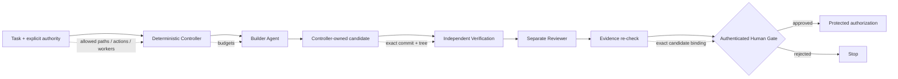

# Bounded Agent Runtime

### Give coding agents freedom to work. Keep authority out of the model.

**BAR is a model-agnostic security runtime for autonomous coding agents.** Codex, Claude Code, OpenCode, containers or your own agent can build and review code, while a deterministic controller keeps scope, evidence, budgets and protected-action authorization outside the LLM.

> **Agents think. BAR constrains. Evidence proves. Humans authorize protected decisions.**

[](https://github.com/steerion-labs/bounded-agent-runtime/releases)
[](LICENSE)
[](docs/00-PREREQUISITES.md)
[](SECURITY.md)

**Five-minute proof:**

```powershell
git clone https://github.com/steerion-labs/bounded-agent-runtime.git
cd bounded-agent-runtime
npm install
npm link
bar quickstart
```

Expected stop:

```text
4/4 PASS: HUMAN_GATE_REQUIRED
```

No real merge. No deploy. No release. BAR proves the workflow stops before protected authority.

## The problem BAR solves

Coding agents are getting good at writing code. The dangerous part is not intelligence. It is **authority**.

If the same model can decide scope, edit files, judge its own evidence and trigger protected actions, prompt injection or a bad tool call can become an operational failure.

BAR separates those concerns.

| Coding agent alone | Coding agent + BAR |
| --- | --- |
| Agent output can directly drive actions | Agent output remains untrusted input |
| Effective scope can drift | Allowed paths and actions are task-bound |
| Agent can inspect its own work | Reviewer is separate and candidate-bound |
| “Tests passed” can be a claim | Verification becomes controller-observed evidence |
| Retry loops can run indefinitely | Calls, retries and wall time are budgeted |
| Approval can go stale | Human Gate is exact-candidate and replay protected |
| Tool access can imply permission | Capability never becomes authority |

### BAR's core rule

```text
The model may propose.
The model may execute within bounds.
The model may review.
The model never becomes the authorization boundary.
```

That rule is the product.

## How BAR works



**Builder and Reviewer can be different agents.** BAR owns the candidate identity and the evidence chain between them.

The reference runtime intentionally performs **no real merge, deploy or release after authorization**. A side-effect adapter must be separately implemented and must re-check the protected authorization immediately before the effect.

## Why this is different

BAR is not another coding agent. It is the layer around the coding agent.

Use the agent you already like. BAR focuses on the part agent frameworks should not ask an LLM to decide: **what is allowed to become authority.**

## What ships today

- CLI for `doctor`, `quickstart`, `task`, `run`, `status`, recovery and Human Gate flows
- first-party adapters for **Codex**, **Claude Code** and **OpenCode**
- Ollama reviewer and generic command adapter
- optional Docker Builder/Reviewer with `network none`
- exact candidate commit + tree binding
- controller-observed verification on disposable candidate copies
- separate Reviewer workspace with mutation detection
- signed Ed25519 Human Gate with pinned approver identity and replay protection
- leases, fencing, retry/model/wall-clock budgets and authenticated journal chain
- read-only MCP and loopback dashboard
- optional HTTPS allowlist broker with controller-owned secret injection
- Windows protected mode with separate role accounts, SID ACLs and real worker-token probes
- adversarial tests for stale evidence, replay, path escape, hostile Git state and worker mutation

## Supported agents

| Adapter | Builder | Reviewer | Default boundary |
| --- | ---: | ---: | --- |
| Codex | ✅ | ✅ | workspace-write / read-only |
| Claude Code | ✅ | ✅ | edit tools / plan + read |
| OpenCode | ✅ | ✅ | pure mode, no auto-approve |
| Ollama | — | ✅ | local reviewer |
| Docker | ✅ | ✅ | disposable, network-none |
| Generic command | ✅ | ✅ | bounded workspace + controller checks |

BAR deliberately avoids dangerous permission-bypass flags in its primary adapter defaults.

## Run a real bounded task

```powershell
bar task `
  --repo C:\path\to\your-repo `
  --intent "Fix the failing parser test" `
  --allow src `
  --allow test `
  --builder codex `
  --reviewer claude `
  --verify npm `
  --verify-arg test `
  --out bounded-task.json

bar run --task bounded-task.json
bar status
```

BAR refuses dirty source repositories and implicit full-repo write authority. The Builder works on a controller-created copy, BAR derives the candidate identity itself, verification runs separately, and the Reviewer receives an exact candidate copy.

## Security posture

**Sandbox the execution. Bound the authority.**

Repository text, prompts, memory, model output, MCP/tool output and reviewer prose remain untrusted context. The controller derives and verifies the facts used for protected authorization.

Read [SECURITY.md](SECURITY.md), the [Threat Model](docs/12-THREAT-MODEL.md) and [Production Hardening](docs/13-PRODUCTION-HARDENING.md).

## Protected Windows mode

Demo mode proves the controller protocol. Protected mode adds a real host boundary with separate Windows identities and SID-based ACL zones.

```text
C:\BoundedAgentRuntime
├── runtime-core       controller only
├── runtime-state      controller only
├── secrets            controller only
├── journal            controller only
├── verification-work  controller only
├── evidence           controlled evidence zone
├── builder-work       builder workspace
└── reviewer-work      reviewer workspace
```

Static ACL inspection is not treated as effective-access proof. `Test-WorkerAccess.ps1` launches probes under the actual Builder and Reviewer credentials.

See [Windows quickstart](docs/09-QUICKSTART-WINDOWS.md).

## What BAR does not claim

- no hosted SaaS control plane
- no automatic merge/deploy/release engine
- no claim that a child process is an OS sandbox
- no claim that the HTTPS broker equals host egress enforcement
- no claim that model review replaces deterministic verification
- no security certification for an unverified deployment host

## Start here

- [5-minute explanation](docs/20-WHY-BAR.md)
- [Architecture](docs/01-ARCHITECTURE.md)
- [CLI + agent adapters](docs/15-CLI-AND-AGENTS.md)
- [Adapter conformance contract](docs/19-ADAPTER-CONFORMANCE.md)
- [MCP + dashboard](docs/16-MCP-AND-DASHBOARD.md)
- [Container isolation](docs/18-CONTAINER-ISOLATION.md)
- [Roadmap](ROADMAP.md)

## Who BAR is for

BAR is useful when you want coding agents to do meaningful work but you do **not** want the model itself to own the final authority boundary.

Good fits include autonomous coding loops, internal developer agents, regulated engineering environments, multi-agent Builder/Reviewer workflows and security-conscious local automation.

## Contribute

BAR is early and intentionally opinionated. That makes this a good time to shape the interfaces, adapters and hardening model.

- open an issue with a concrete use case
- propose an agent integration
- pick a `good first issue`
- challenge the threat model
- send a PR with negative tests for security-sensitive changes

See [CONTRIBUTING.md](CONTRIBUTING.md).

If this solves a problem you care about, **star the repo**. It helps other agent builders discover the project.

## License

Apache-2.0. See [LICENSE](LICENSE) and [NOTICE](NOTICE).
