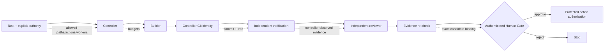

# Bounded Agent Runtime

**Run autonomous coding agents. Keep authority outside the model.**

Bounded Agent Runtime (BAR) is an open-source security runtime for AI coding agents. It lets Codex, Claude, OpenCode, containers or your own agent build and review code while a deterministic controller owns scope, evidence, budgets and protected-action authorization.

> **Agents think. The controller authorizes. Evidence proves. Humans approve protected decisions.**

[](LICENSE)
[](docs/00-PREREQUISITES.md)
[](SECURITY.md)

## Why BAR exists

Coding agents can already edit files, run tools and solve real engineering tasks. The harder question is: **what is allowed to become authority?**

| Without BAR | With BAR |
| --- | --- |
| Model output can directly drive actions | Model output stays untrusted input |
| Agent decides its own effective scope | Task binds allowed paths, actions and workers |
| Tests can be an agent claim | Verification runs separately and becomes controller-observed evidence |
| Reviewer can see stale or different code | Review is bound to exact candidate commit + tree |
| Retry loops can run forever | Calls, retries and wall-clock time are budgeted |
| Approval can become stale or replayed | Human Gate is signed, identity-bound and nonce-protected |
| Tool/MCP availability can imply permission | Tools expose capability; controller retains authority |

## The bounded workflow



The reference runtime intentionally performs **no real merge, deploy or release** after authorization. A side-effect adapter must be separately implemented and must re-check the protected authorization boundary.

## What ships in BAR

- `bar` CLI with `doctor`, `agents`, `task`, `run`, `status`, recovery and Human Gate commands
- first-party local CLI adapters for Codex, Claude Code and OpenCode
- Ollama reviewer adapter and a generic command adapter
- optional disposable Docker container Builder/Reviewer adapter
- deterministic state machine, lease/fencing and wall-clock/model/retry budgets
- controller-derived Git candidate SHA + tree hash
- task-bound HMAC evidence and authenticated append-only journal chain
- controller-observed verification commands executed without a shell on a disposable candidate copy
- independent Reviewer workspace with mutation detection
- Ed25519 Human Gate with pinned approver identity/fingerprint and replay-protected nonce consumption
- read-only MCP bridge: status, evidence and doctor only
- loopback-only read-only dashboard
- HTTPS allowlist broker with DNS/private-address checks and controller-side secret injection
- Windows protected-mode scripts with role accounts, SID-based ACLs and real worker-token access probes
- adversarial tests for state forgery, stale evidence, replay, Git hooks, path escapes and worker mutation

## 5-minute start

Requirements: Node.js 20+ and Git. Docker and external agent CLIs are optional.

```powershell
git clone https://github.com/steerion-labs/bounded-agent-runtime.git
cd bounded-agent-runtime
npm install
npm link
bar doctor
```

To run the synthetic no-model demo:

```powershell
npm run demo:reset
npm run demo:init
npm run demo:run
```

Expected stop:

```text
HUMAN_GATE_REQUIRED
```
## Run a real bounded coding task

BAR refuses dirty source repositories and refuses implicit full-repo write authority. Allow paths explicitly:

```powershell
bar task `
  --repo C:\path\to\your-repo `
  --intent "Fix the failing parser test" `
  --allow src `
  --allow test `
  --builder codex `
  --reviewer claude `
  --verify npm `
  --verify-arg test `
  --out bounded-task.json

bar run --task bounded-task.json
bar status
```

The Builder works on a controller-created local Git copy. BAR commits the resulting allowlisted change, derives the exact commit/tree itself, runs declared verification on another candidate copy, and then gives a separate exact candidate copy to the Reviewer.

Agent adapters do **not** use dangerous permission-bypass flags by default. Codex uses workspace-write/read-only sandbox modes, Claude uses bounded tool/permission modes, and OpenCode runs without `--auto`.

## Agent support

| Adapter | Builder | Reviewer | Default boundary |
| --- | ---: | ---: | --- |
| Codex | ✅ | ✅ | workspace-write / read-only sandbox |
| Claude Code | ✅ | ✅ | edit tools / plan+read tools |
| OpenCode | ✅ | ✅ | pure mode, no auto-approve |
| Ollama | — | ✅ | local reviewer prompt |
| Generic command | ✅ | ✅ | bounded workspace + controller checks |
| Docker container | ✅ | ✅ | disposable, `network none`, no host `.git` |
See [`docs/15-CLI-AND-AGENTS.md`](docs/15-CLI-AND-AGENTS.md) for task creation and adapter details.

## Container isolation without a new platform

BAR does not build another container orchestrator. The optional Docker adapter uses Docker as an isolation provider while BAR keeps authority in the controller.

- task stores an immutable `@sha256:` image digest
- `--network none`
- all Linux capabilities dropped
- `no-new-privileges`
- PID, memory and CPU limits
- host `.git` is never copied into the container
- Builder output copies back only task-allowlisted paths
- Reviewer receives a disposable copy and nothing is copied back

This is an optional isolation adapter, not a claim that Docker alone solves every host-security requirement.

## MCP and dashboard

BAR's MCP surface is intentionally **observation-only**:

- `bounded_status`
- `bounded_evidence`
- `bounded_doctor`

There is no MCP `approve`, `merge`, `deploy` or `authorize` tool. MCP can expose capability without becoming an authority source.

```powershell
bar mcp
bar dashboard --port 4780
```

The dashboard binds only to loopback and exposes sanitized state/evidence. It is not a second Human Gate. See [`docs/16-MCP-AND-DASHBOARD.md`](docs/16-MCP-AND-DASHBOARD.md).
## Network and secrets

BAR includes an optional controller-owned HTTPS broker for code that should use a narrow approved network path:

- HTTPS only
- host, port and method allowlists
- DNS resolution checked before connection
- private, loopback, link-local and cloud-metadata targets rejected
- request/response size limits and timeouts
- redirects disabled unless policy explicitly enables them
- secrets stored in the controller secret zone and injected as configured headers

```powershell
bar net check https://api.example.com --policy policies\network-policy.example.json
$env:MY_TOKEN = '...'
bar secret set example_api --from-env MY_TOKEN
bar broker request https://api.example.com/v1/status --policy policies\network-policy.example.json
```

**The broker is not a firewall.** If a worker still has unrestricted direct network access, it can bypass the broker. Enforce worker egress at the OS/container boundary for protected deployments. See [`docs/17-NETWORK-AND-SECRETS.md`](docs/17-NETWORK-AND-SECRETS.md).

## Authenticated Human Gate

Create a local Ed25519 approval key and bind the expected public key fingerprint + decision identity:

```powershell
bar gate keygen .human-gate
$env:BOUNDED_AGENT_APPROVER_IDENTITY = 'demo-approver'
$env:BOUNDED_AGENT_APPROVAL_PUBLIC_KEY = (Resolve-Path .human-gate\public.pem).Path
$env:BOUNDED_AGENT_APPROVAL_KEY_FINGERPRINT = '<printed fingerprint>'

$signature = bar gate sign .human-gate\private.pem
bar approve $signature
bar authorize merge
```

Authorization still performs no remote mutation. It proves that the exact reviewed candidate has a valid protected-action authorization.
## Protected Windows mode

Demo mode proves the controller protocol but is not an OS security boundary. The Windows hardening scripts prepare separate role accounts and SID-based ACL zones. BAR does not pretend that a same-token child process becomes isolated: protected runtime execution fails closed for local CLI adapters and currently requires the disposable container adapter for Builder/Reviewer.

```text
C:\BoundedAgentRuntime
├── runtime-core       controller only
├── runtime-state      controller only
├── secrets            controller only
├── journal            controller only
├── verification-work  independent verifier/reviewer + controller
├── evidence           controlled evidence zone
├── builder-work       builder workspace
└── reviewer-work      reviewer workspace
```

```powershell
.\scripts\windows\Install-BoundedAgentRuntime.ps1
.\scripts\verify\Test-HostBaseline.ps1
.\scripts\verify\Test-StaticAcl.ps1
$builder = Get-Credential '.\AgentBuilder'
$reviewer = Get-Credential '.\AgentReviewer'
.\scripts\verify\Test-WorkerAccess.ps1 -BuilderCredential $builder -ReviewerCredential $reviewer
```

Static ACL checks are not treated as proof of effective access; `Test-WorkerAccess.ps1` runs probes under the actual worker credentials.

## Threats BAR is designed to stop

The regression suite covers candidate/tree drift, stale or tampered evidence, task-authority mutation, forged state, approval replay, approver-key substitution, journal truncation/tampering, stale leases/fencing, worker timeouts, hostile Git hooks/environment, path traversal, hardlink/symlink escape and Reviewer workspace mutation.

## What BAR does not claim

- no hosted SaaS control plane
- no automatic merge/deploy/release engine
- no claim that a child process is an OS sandbox
- no claim that the HTTPS broker equals host egress enforcement
- no claim that a model review replaces deterministic verification
- no security certification for an unverified deployment host
## Security model in one sentence

**Sandbox the execution. Bound the authority.** Repository text, prompts, model output, handoffs, memory, MCP/tool output and reviewer prose remain untrusted context; the controller derives and verifies the facts used for protected authorization.

Read [SECURITY.md](SECURITY.md), the [Threat Model](docs/12-THREAT-MODEL.md) and [Production Hardening](docs/13-PRODUCTION-HARDENING.md).

## Documentation

| Guide | Purpose |
| --- | --- |
| [`docs/00-PREREQUISITES.md`](docs/00-PREREQUISITES.md) | requirements |
| [`docs/01-ARCHITECTURE.md`](docs/01-ARCHITECTURE.md) | architecture |
| [`docs/05-EVIDENCE-AND-HANDOFF.md`](docs/05-EVIDENCE-AND-HANDOFF.md) | evidence model |
| [`docs/06-HUMAN-GATE.md`](docs/06-HUMAN-GATE.md) | signed approvals |
| [`docs/09-QUICKSTART-WINDOWS.md`](docs/09-QUICKSTART-WINDOWS.md) | Windows protected mode |
| [`docs/12-THREAT-MODEL.md`](docs/12-THREAT-MODEL.md) | attacker model and limits |
| [`docs/14-INTEGRATING-YOUR-AGENT.md`](docs/14-INTEGRATING-YOUR-AGENT.md) | adapter concepts |
| [`docs/15-CLI-AND-AGENTS.md`](docs/15-CLI-AND-AGENTS.md) | CLI + first-party adapters |
| [`docs/16-MCP-AND-DASHBOARD.md`](docs/16-MCP-AND-DASHBOARD.md) | observation surfaces |
| [`docs/17-NETWORK-AND-SECRETS.md`](docs/17-NETWORK-AND-SECRETS.md) | broker + secret boundary |
| [`docs/18-CONTAINER-ISOLATION.md`](docs/18-CONTAINER-ISOLATION.md) | Docker isolation adapter |

## Contributing

Issues and pull requests are welcome. Security-sensitive changes should include threat analysis and negative tests. See [CONTRIBUTING.md](CONTRIBUTING.md).

If BAR helps you build safer autonomous agents, **star the repo** so other agent builders can find and improve it.

## License

Apache-2.0. See [LICENSE](LICENSE) and [NOTICE](NOTICE).
