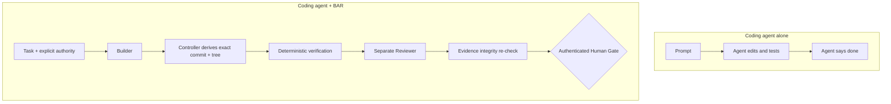

# Why put BAR around a coding agent?

A capable coding agent can edit files and run commands. BAR addresses a different problem: deciding what output is allowed to become trusted authority.



BAR is useful when a team wants agent speed without allowing model output to become its own permission, verification or release boundary.

## Five-minute proof

```powershell
bar quickstart
```

The command runs an isolated synthetic task and must finish at `HUMAN_GATE_REQUIRED`. It performs no real merge, deploy or release.

## Good fits

- coding-agent automation in security-conscious teams
- Builder/Reviewer workflows that need exact candidate identity
- local or containerized agent experiments where side effects must stay bounded
- organizations evaluating Codex, Claude Code, OpenCode or custom agents behind one deterministic authority layer

## Not the goal

BAR is not trying to replace the coding agent, IDE, CI platform, container runtime or firewall. It is the authority and evidence boundary around those components.
